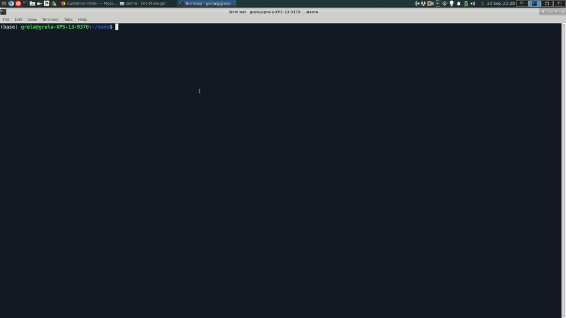

# platinium-booker

# What is it?
It's an automatic booker for the [Fitness Platinium fitness network](https://fitnessplatinium.pl/en). 

# How does it work?



Follow three steps:

* Type in your FP login and password in the **auth.json** file.

* Use an HTML Reservation Tool to create your own reservations saved to **reservations.json** file. Simply run the script which generates the tool:
```
python reservation_tool.py
```

* Run the booking script:
```
python booker.py
```
---
### Booker freezes/doesn't do much
If the script freezes, do not worry! Most likely you are not ready for booking. 
This fitness network works by enabling classes a week in advance at midnight. 

#### Booking example:
You want to attend weekly thursday classes which start at 10am. 
The booker will activate on wednesday midnight (or a little bit earlier) to book the next-week class.

---


